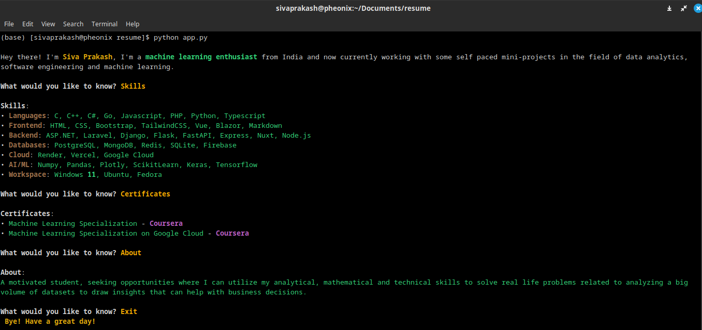

# Resume Cli


This is a Python-based Command-Line Interface (CLI) portfolio. It offers a straightforward and interactive method for presenting your internships, projects, and skills within a terminal environment.

## Installation

Open command prompt and create new environment

```
conda create -n your_env_name python=(any_version_number > 3.10)
```

Then Activate the newly created environment

```
conda activate your_env_name
```

Clone the repository using `git`

```
git clone https://github.com/Prakashdeveloper03/Resume-Cli.git
```

Change to the cloned directory

```
cd <directory_name>
```

Then install all requirement packages for the app

```
pip install -r requirements.txt
```

## Usage

To start the quiz, run the following command:

```shell
python app.py
```

## Screenshot


